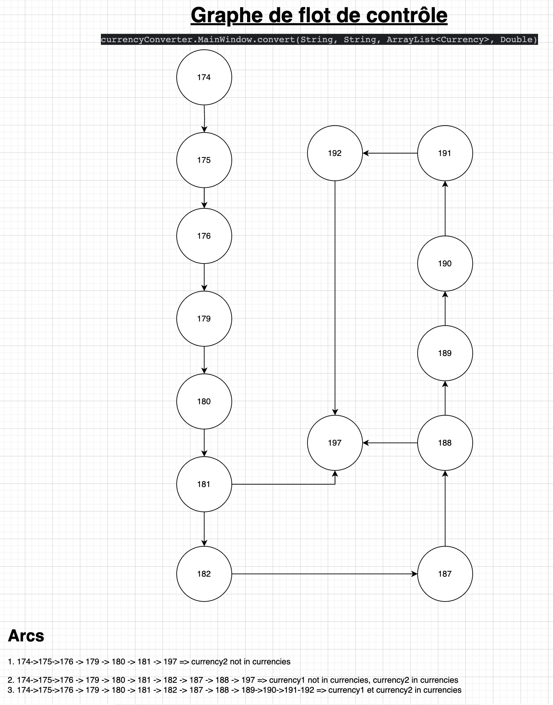
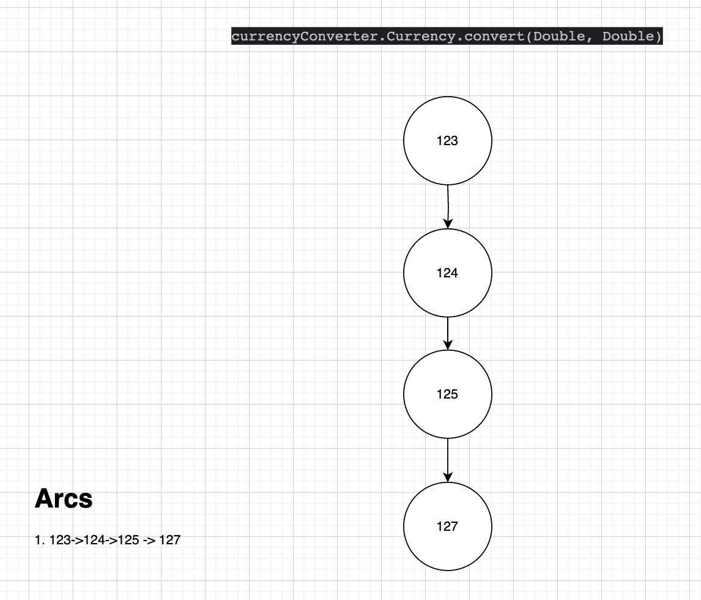

# Rapport

## Boîte Noire

Pour Currency.convert, trois partitions ont été testées :
- D1 = {0 ≤ d ≤ 1 000 000}
- D2 = {d < 0}
- D3 = {d > 1 000 000}
Pour MainWindow.convert, les partitions étaient basées sur les valeurs de la monnaie (d) et les types de devises :
- D1 = {0 ≤ d ≤ 1 000 000}
- D2 = {d < 0}
- D3 = {d > 1 000 000}
- Divise1 = {USD, CAD, GBP, EUR, CHF, AUD}
- Divise2 = {CHY, JPY, TEST1, TEST2}

Des valeurs border ont été utilisées pour tester les limites des partitions.
1. Pour les valeurs négatives (D2), le comportement n'est pas clairement spécifié, nécessitant une clarification des exigences.

2. La gestion des devises non reconnues (comme TEST1, TEST2) n'est pas clairement définie. 

### Conclusion
Les tests ont révélé que les méthodes de conversion de devises fonctionnent correctement pour la majorité des cas de test. Cependant, des améliorations en termes de validation des entrées et de gestion des cas exceptionnels seront nécessaires.
## Boîte Blanche

- couverture des instructions
La couverture des de toutes les instructions ont été couvert avec les cas suivantes: 

1. cas 1: currency1 not in currencies currency 2 not in currencies
2. cas 2: currency1 not in currencies currency 2 in currencies
3. cas 3: currency1 in currencies and currency2 not in currencies
4. cas 4: currency1 in currencies & currency2 in currencies

Voici les graphes de flot de contrôle pour chacun des deux méthodes

- couverture des arcs du graphe de flot de contrôle
avec ces cas chaque arcs est traversé au moins une fois 

- couverture des chemins indépendants du graphe de flot de contrôle
avec les cas 1,3 et 4 V(G) = 3 est couvert
- couverture des conditions
Pas pertinent (car pas de condition composées)
- couverture des i chemins
    - on saute la boucle → Cas de test: currencies = []
    - une itération de la boucle → Cas de test: T = [e1]
    - deux itérations → Cas de test: T = [e1, e2]
    - m itérations (m < 6) → Cas de test: T = [e1 , e2 ,..em]
    - 7, 8 et 9 iterations → Cas de test:
    T = [e1,e2,..em,.. e7]
    T = [e1,e2,..em,.., e7, e8]
    T = [e1,e2,..em,.., e7, e8, e9]
### Conclusion

Les tests concluses que la méthode convert dans MainWindow, aurait pu tester la condition au début si currency1 et currency2 se trouve dans la liste, si ce n'est pas le cas, il faut afficher un message d'erreur et ne pas exécuter les instructutions suivantes. Pour la méthode convert dans Currency, la structure est bonne mais comme les tests de boîte noire révèle, il n'y a pas de traitement des edges cases.